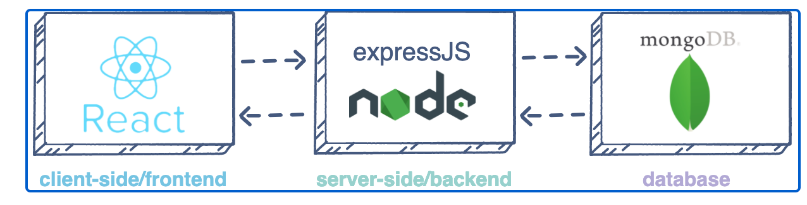
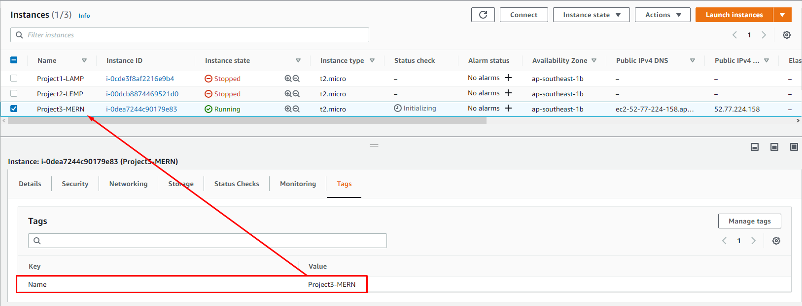

# web-solution-based-on-mern-stack-in-aws-cloud
In this project, you are tasked to implement a web solution based on **MERN** stack in AWS Cloud.

**MERN** Web stack consists of following components:

- [MongoDB](https://www.mongodb.com/): A document-based, No-SQL database used to store application data in a form of documents.
- [ExpressJS](https://expressjs.com/): A server side Web Application framework for Node.js.
- [ReactJS](https://reactjs.org/): A frontend framework developed by Facebook. It is based on JavaScript, used to build User Interface (UI) components.
- [Node.js](https://nodejs.org/en/): A JavaScript runtime environment. It is used to run JavaScript on a machine rather than in a browser.

As shown on the illustration above, a user interacts with the ReactJS UI components at the application front-end residing in the browser. This frontend is served by the application backend residing in a server, through ExpressJS running on top of NodeJS.

Any interaction that causes a data change request is sent to the NodeJS based Express server, which grabs data from the MongoDB database if required, and returns the data to the frontend of the application, which is then presented to the user.

**Side Self Study**
- Make a research what types of [Database Management Systems (DBMS) exist and what each type is more suitable for](https://www.alooma.com/blog/types-of-modern-databases). Be able to explain the difference between Relational DBMS and NoSQL (of a different kind).
- Get yourself familiar with a concept of [Web Application Frameworks](https://en.wikipedia.org/wiki/Web_framework). Get to know what server-side (backend) and client-side (forntend) frameworks exist and what they are used for.
- [Practice basic JavaScript syntax just for fun](https://www.w3schools.com/js/js_intro.asp).
- Explore what [RESTful API](https://restfulapi.net/) is and what it is used for in Web development.
- Read what [Cascading Style Sheets (CSS)](https://en.wikipedia.org/wiki/CSS) is used for and browse basic [syntax and properties](https://www.w3schools.com/css/css_intro.asp).

In order to complete this project you will need an AWS account and a virtual server with Ubuntu Server OS.

If you do not have an AWS account - go back to Project 1 Step 0 to sign in to AWS free tier account and create a new EC2 Instance of t2.nano family with Ubuntu Server 20.04 LTS (HVM) image. Remember, you can have multiple EC2 instances, but make sure you **STOP** the ones you are not working with at the moment to save available free hours.

**Hint #1**: When you create your EC2 Instances, you can add Tag “Name” to it with a value that corresponds to a current project you are working on - it will be reflected in the name of the EC2 Instance. Like this:

**Hint #2 (for Windows users only)**: In previous projects we used Putty and Git Bash to connect to our EC2 Instances. For Windows, there is a tool you can use to open multiple tabs of your CLI in a single window.

[MobaXterm](https://mobaxterm.mobatek.net/download.html) is an advanced multirotocol and multitool terminal for Windows.

Download and launch MobaxTerm, create a new SSH session with , ‘ubuntu’ as username and your private key (.pem file) like this:

