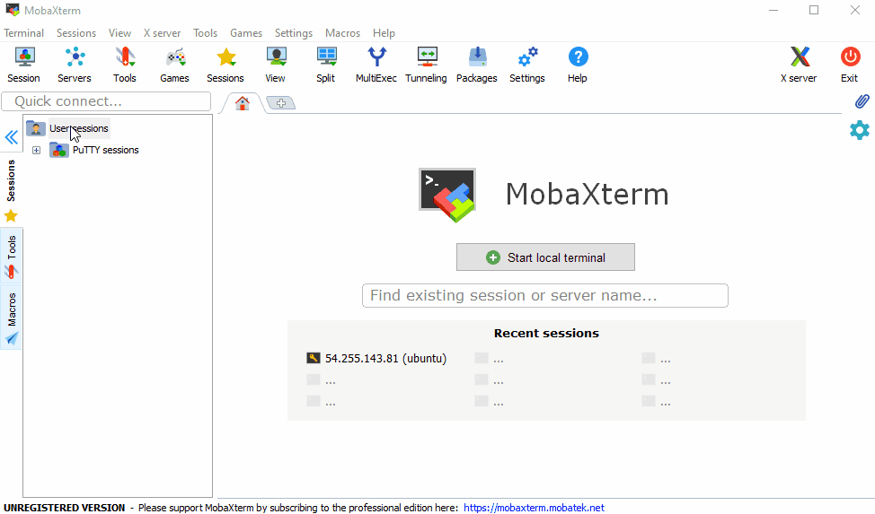
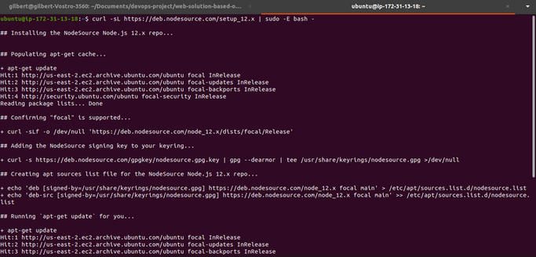
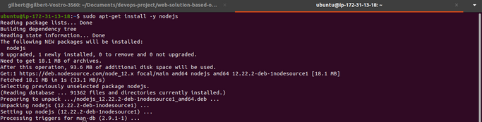
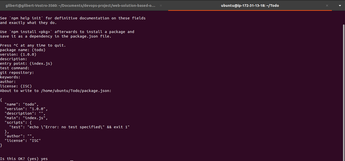
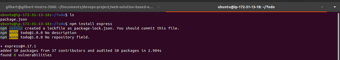
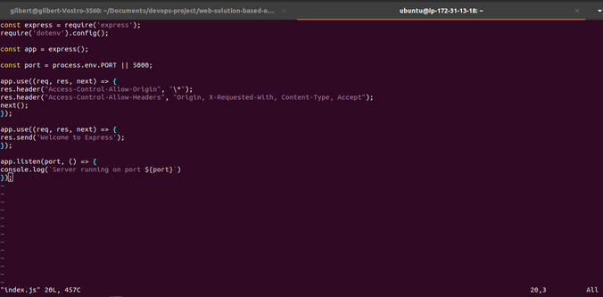
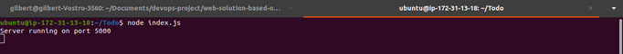
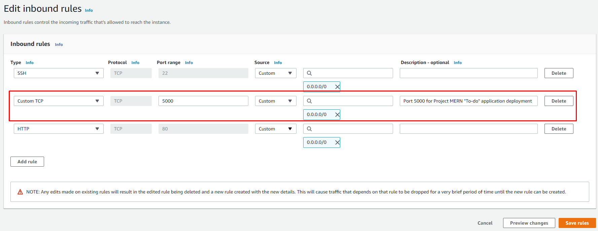
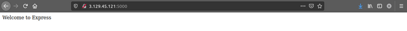
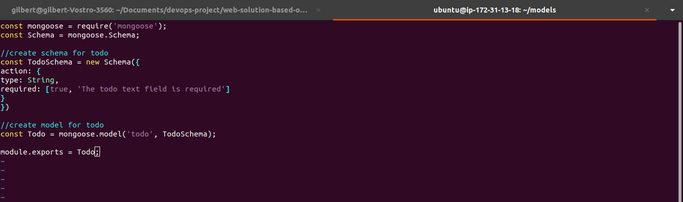

# web-solution-based-on-mern-stack-in-aws-cloud
In this project, you are tasked to implement a web solution based on **MERN** stack in AWS Cloud.

**MERN** Web stack consists of following components:

- [MongoDB](https://www.mongodb.com/): A document-based, No-SQL database used to store application data in a form of documents.
- [ExpressJS](https://expressjs.com/): A server side Web Application framework for Node.js.
- [ReactJS](https://reactjs.org/): A frontend framework developed by Facebook. It is based on JavaScript, used to build User Interface (UI) components.
- [Node.js](https://nodejs.org/en/): A JavaScript runtime environment. It is used to run JavaScript on a machine rather than in a browser.

As shown on the illustration above, a user interacts with the ReactJS UI components at the application front-end residing in the browser. This frontend is served by the application backend residing in a server, through ExpressJS running on top of NodeJS.

Any interaction that causes a data change request is sent to the NodeJS based Express server, which grabs data from the MongoDB database if required, and returns the data to the frontend of the application, which is then presented to the user.

**Side Self Study**
- Make a research what types of [Database Management Systems (DBMS) exist and what each type is more suitable for](https://www.alooma.com/blog/types-of-modern-databases). Be able to explain the difference between Relational DBMS and NoSQL (of a different kind).
- Get yourself familiar with a concept of [Web Application Frameworks](https://en.wikipedia.org/wiki/Web_framework). Get to know what server-side (backend) and client-side (forntend) frameworks exist and what they are used for.
- [Practice basic JavaScript syntax just for fun](https://www.w3schools.com/js/js_intro.asp).
- Explore what [RESTful API](https://restfulapi.net/) is and what it is used for in Web development.
- Read what [Cascading Style Sheets (CSS)](https://en.wikipedia.org/wiki/CSS) is used for and browse basic [syntax and properties](https://www.w3schools.com/css/css_intro.asp).

In order to complete this project you will need an AWS account and a virtual server with Ubuntu Server OS.

If you do not have an AWS account - go back to Project 1 Step 0 to sign in to AWS free tier account and create a new EC2 Instance of t2.nano family with Ubuntu Server 20.04 LTS (HVM) image. Remember, you can have multiple EC2 instances, but make sure you **STOP** the ones you are not working with at the moment to save available free hours.

**Hint #1**: When you create your EC2 Instances, you can add Tag “Name” to it with a value that corresponds to a current project you are working on - it will be reflected in the name of the EC2 Instance. Like this:

**Hint #2 (for Windows users only)**: In previous projects we used Putty and Git Bash to connect to our EC2 Instances. For Windows, there is a tool you can use to open multiple tabs of your CLI in a single window.

[MobaXterm](https://mobaxterm.mobatek.net/download.html) is an advanced multirotocol and multitool terminal for Windows.

Download and launch MobaxTerm, create a new SSH session with , ‘ubuntu’ as username and your private key (.pem file) like this:

**Task**

To deploy a simple **To-Do** application that creates To-Do lists like this:

## backend configuration
Update ubuntu
- sudo apt update

Upgrade ubuntu
- sudo apt upgrade

Lets get the location of Node.js software from [Ubuntu repositories](https://github.com/nodesource/distributions#deb).
- curl -sL https://deb.nodesource.com/setup_12.x | sudo -E bash -

**Install Node.js on the server**

Install Node.js with the command below
- sudo apt-get install -y nodejs

**Note**: The command above installs both **nodejs** and **npm**. NPM is a package manager for Node like **apt** for Ubuntu, it is used to install Node modules & packages and to manage dependency conflicts.

Verify the node installation with the command below
- node -v

Verify the node installation with the command below
- npm -v

**Application Code Setup**

Create a new directory for your To-Do project:
-  mkdir Todo

Run the command below to verify that the **Todo** directory is created with **ls** command
- ls

**TIP:** In order to see some more useful information about files and directories, you can use following combination of keys **ls -lih -** it will show you different properties and size in human readable format. You can learn more about different useful keys for ls command with **ls --help.**

Now change your current directory to the newly created one:
- cd Todo

Next, you will use the command **npm init** to initialise your project, so that a new file named **package.json** will be created. This file will normally contain information about your application and the dependencies that it needs to run. Follow the prompts after running the command. You can press **Enter** several times to accept default values, then accept to write out the **package.json** file by typing **yes**.

Run the command ls to confirm that you have package.json file created.

**Install ExpressJS**

Remember that Express is a framework for Node.js, therefore a lot of things developers would have programmed is already taken care of out of the box. Therefore it simplifies development, and abstracts a lot of low level details. For example, Express helps to define routes of your application based on HTTP methods and URLs.

To use express, install it using npm:
- npm install express

Now create a file **index.js** with the command below
- touch index.js

Run **ls** to confirm that your index.js file is successfully created

install the **dotenv** module
- npm install dotenv

Open the index.js file with the command below
- vim index.js

Type the code below into it and save. Do not get overwhelmed by the code you see. For now, simply paste the code into the file.

const express = require('express');
require('dotenv').config();

const app = express();

const port = process.env.PORT || 5000;

app.use((req, res, next) => {
res.header("Access-Control-Allow-Origin", "\*");
res.header("Access-Control-Allow-Headers", "Origin, X-Requested-With, Content-Type, Accept");
next();
});

app.use((req, res, next) => {
res.send('Welcome to Express');
});

app.listen(port, () => {
console.log(`Server running on port ${port}`)
});

Now it is time to start our server to see if it works. Open your terminal in the same directory as your index.js file and type:
- node index.js
If every thing goes well, you should see Server running on port 5000 in your terminal.

Now we need to open this port in EC2 Security Groups. Refer to Project 1 Step 1 – Installing the Nginx Web Server. There we created an inbound rule to open TCP port 80, you need to do the same for port 5000, like this:

Open up your browser and try to access your server’s Public IP or Public DNS name followed by port 5000:
- http://PublicIP-or-PublicDNS>:5000

Quick reminder how to get your server’s Public IP and public DNS name:
- You can find it in your AWS web console in EC2 details
- Run curl -s http://169.254.169.254/latest/meta-data/public-ipv4 for Public IP address or curl -s http://169.254.169.254/latest/meta-data/public-hostname for Public DNS name.

 
 **Routes**

 There are three actions that our To-Do application needs to be able to do:
 - Create a new task
 - Display list of all tasks
 - Delete a completed task

 Each task will be associated with some particular endpoint and will use different standard [HTTP request methods](https://developer.mozilla.org/en-US/docs/Web/HTTP/Methods): POST, GET, DELETE.

For each task, we need to create **routes** that will define various endpoints that the **To-do** app will depend on. So let us create a folder **routes**
- mkdir routes
**Tip:** You can open multiple shells in Putty or Linux/Mac to connect to the same EC2

Change directory to **routes** folder.
- cd routes

Now, create a file **api.js** with the command below
- touch api.js

Open the file with the command below
- vim api.js

Copy below code in the file. (Do not be overwhelmed with the code)

const express = require ('express');
const router = express.Router();

router.get('/todos', (req, res, next) => {

});

router.post('/todos', (req, res, next) => {

});

router.delete('/todos/:id', (req, res, next) => {

})

module.exports = router;

**Models**

Now comes the interesting part, since the app is going to make use of [Mongodb](https://www.mongodb.com/) which is a NoSQL database, we need to create a model.

A model is at the heart of JavaScript based applications, and it is what makes it interactive.

We will also use models to define the database schema . This is important so that we will be able to define the fields stored in each Mongodb document. (**Seems like a lot of information, but not to worry, everything will become clear to you over time. I promise!!!**)

In essence, the Schema is a blueprint of how the database will be constructed, including other data fields that may not be required to be stored in the database. These are known as virtual properties

To create a Schema and a model, install [mongoose](https://mongoosejs.com/) which is a Node.js package that makes working with mongodb easier.

Change directory back Todo folder with **cd ..** and install Mongoose
- npm install mongoose

Create a new folder with **mkdir models** command

Change directory into the newly created ‘models’ folder with **cd models**.

Inside the models folder, create a file and name it todo.js
- touch todo.js

**Tip**: All three commands above can be defined in one line to be executed consequently with help of && operator, like this:
- mkdir models && cd models && touch todo.js

Open the file created with **vim todo.js** then paste the code below in the file:
const mongoose = require('mongoose');
const Schema = mongoose.Schema;

//create schema for todo
const TodoSchema = new Schema({
action: {
type: String,
required: [true, 'The todo text field is required']
}
})

//create model for todo
const Todo = mongoose.model('todo', TodoSchema);

module.exports = Todo;

